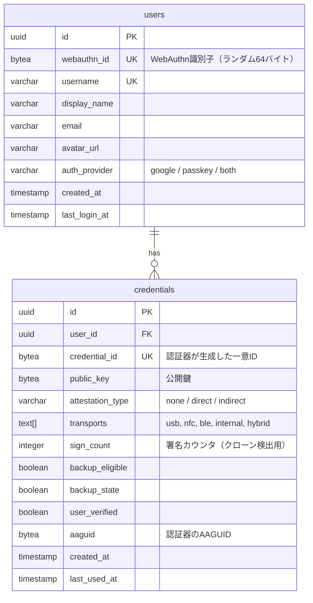

# パスキー（WebAuthn/FIDO2）設計ドキュメント

## 1. 概要

### パスキーとは

パスキー（Passkey）は、FIDO2/WebAuthn標準に基づくパスワードレス認証方式。
デバイスの生体認証（TouchID, FaceID）やPINと公開鍵暗号を組み合わせ、
パスワード漏洩・フィッシングのリスクを根本的に排除する。

### 従来のパスワード認証との違い

| 観点 | パスワード認証 | パスキー認証 |
|------|-------------|------------|
| 秘密情報の保存先 | サーバー（ハッシュ） | ユーザーデバイスのみ |
| フィッシング耐性 | なし | あり（Origin検証） |
| リプレイ攻撃 | 可能 | 不可（チャレンジ・レスポンス） |
| ユーザー体験 | パスワード入力 | 生体認証/PINのみ |
| サーバー漏洩時の影響 | パスワードハッシュ流出 | 公開鍵のみ（無害） |

### Discoverable Credentials（本プロジェクトで採用）

パスキーには2種類ある:

| 種類 | ユーザー名入力 | 鍵の保存先 | 本プロジェクト |
|------|-------------|-----------|-------------|
| Non-discoverable | 必要 | サーバー側で管理 | - |
| **Discoverable** | **不要** | **デバイス＋クラウド同期** | **採用** |

Discoverable Credentialsでは、ユーザー名の入力なしに認証できる。
認証器（デバイス）が `userHandle` を保持しているため、
サーバーはレスポンスからユーザーを特定できる。

---

## 2. WebAuthn プロトコル

### 2.1 登場人物

```
┌──────────────┐     ┌──────────────┐     ┌──────────────┐
│   ユーザー    │     │  ブラウザ     │     │  サーバー     │
│  (認証器)     │◄───►│ (User Agent)  │◄───►│  (RP)        │
│ TouchID等     │     │ WebAuthn API  │     │ go-webauthn  │
└──────────────┘     └──────────────┘     └──────────────┘
```

- **RP (Relying Party)**: サーバー側。チャレンジの生成と署名の検証を行う
- **User Agent**: ブラウザ。`navigator.credentials` APIを提供
- **Authenticator**: 認証器。鍵ペアの生成・署名を行う（TouchID, FaceID, Windows Hello等）

### 2.2 登録フロー（Registration Ceremony）

```
ユーザー              ブラウザ                    サーバー
  │                    │                           │
  │  「パスキー登録」   │                           │
  │ ──────────────────>│  POST /passkey/register    │
  │                    │ ─────────────────────────> │
  │                    │                           │
  │                    │  CredentialCreationOptions │
  │                    │  (challenge, rp, user)     │
  │                    │ <───────────────────────── │
  │                    │                           │  SessionData保存
  │  生体認証/PIN要求   │                           │
  │ <──────────────────│                           │
  │                    │                           │
  │  承認              │                           │
  │ ──────────────────>│                           │
  │                    │  鍵ペア生成               │
  │                    │  (秘密鍵はデバイスに保持)  │
  │                    │                           │
  │                    │  POST /passkey/register/finish
  │                    │  (公開鍵, attestation)     │
  │                    │ ─────────────────────────> │
  │                    │                           │  チャレンジ検証
  │                    │                           │  公開鍵をDB保存
  │                    │          200 OK           │
  │                    │ <───────────────────────── │
```

### 2.3 認証フロー（Authentication Ceremony）

Discoverable Credentialsの場合、ユーザー名の入力は不要。

```
ユーザー              ブラウザ                    サーバー
  │                    │                           │
  │  「ログイン」       │                           │
  │ ──────────────────>│  POST /passkey/login       │
  │                    │ ─────────────────────────> │
  │                    │                           │
  │                    │  CredentialRequestOptions  │
  │                    │  (challenge, rpId)         │
  │                    │ <───────────────────────── │
  │                    │                           │  SessionData保存
  │  生体認証/PIN要求   │                           │
  │ <──────────────────│                           │
  │                    │                           │
  │  承認              │                           │
  │ ──────────────────>│                           │
  │                    │  秘密鍵で署名             │
  │                    │  (userHandle付き)          │
  │                    │                           │
  │                    │  POST /passkey/login/finish │
  │                    │  (signature, userHandle)   │
  │                    │ ─────────────────────────> │
  │                    │                           │  userHandleでユーザー特定
  │                    │                           │  公開鍵で署名検証
  │                    │                           │  signCount確認
  │                    │          200 OK           │
  │                    │ <───────────────────────── │
```

### 2.4 セキュリティ機構

| 機構 | 説明 |
|------|------|
| **Challenge** | サーバーが生成するランダム値。リプレイ攻撃を防止 |
| **Origin検証** | RPのOriginと一致するか検証。フィッシング防止 |
| **SignCount** | 認証ごとにインクリメント。クローン検出 |
| **UserVerification** | 生体認証/PINが行われたか検証 |
| **Attestation** | 認証器の正当性を検証（オプション） |

---

## 3. 技術選定

### 3.1 バックエンドライブラリ

**[go-webauthn/webauthn](https://github.com/go-webauthn/webauthn)** を採用。

| 項目 | 詳細 |
|------|------|
| Stars | ~1.2k |
| ライセンス | BSD-3-Clause |
| Go対応 | Go 1.24+ |
| 最新リリース | 2025年11月 |
| メンテナンス | 活発 |
| 前身 | duo-labs/webauthn（アーカイブ済み） |

**選定理由:**
- Go WebAuthnライブラリの事実上の標準
- FIDO2完全準拠
- Discoverable Credentials / Passkey専用API（`BeginDiscoverableLogin`, `FinishPasskeyLogin`）を提供
- セッションデータ管理が明確

### 3.2 フロントエンド

ブラウザ標準の `navigator.credentials` API を使用。
Base64URL変換の簡略化のため **@simplewebauthn/browser** の導入を検討。

### 3.3 ブラウザサポート（2025-2026）

| ブラウザ | バージョン | 備考 |
|---------|-----------|------|
| Chrome | 109+ | 完全対応 |
| Safari | 16+ | iCloud Keychain同期対応 |
| Edge | 109+ | Chrome同等 |
| Firefox | 139+ | プラットフォーム認証器対応 |

主要モダンブラウザで完全サポートされている。

---

## 4. go-webauthn/webauthn API

### 4.1 初期化

```go
webAuthn, err := webauthn.New(&webauthn.Config{
    RPID:          "localhost",              // ドメイン名
    RPDisplayName: "ChatterBox",             // アプリ表示名
    RPOrigins:     []string{"http://localhost:8080"}, // 許可するOrigin
    AuthenticatorSelection: protocol.AuthenticatorSelection{
        RequireResidentKey: protocol.ResidentKeyRequired(),  // Discoverable
        UserVerification:   protocol.VerificationRequired,   // 生体認証必須
    },
})
```

### 4.2 User Interface

サーバー側で実装が必要なインターフェース:

```go
type User interface {
    WebAuthnID() []byte              // ユーザー識別子（最大64バイト、ランダム値推奨）
    WebAuthnName() string            // ユーザー名（例: "alex@example.com"）
    WebAuthnDisplayName() string     // 表示名（例: "Alex"）
    WebAuthnCredentials() []Credential // 登録済みクレデンシャル一覧
}
```

### 4.3 登録 API

```go
// 登録開始: CredentialCreationOptionsを生成
options, session, err := webAuthn.BeginRegistration(
    user,
    webauthn.WithResidentKeyRequirement(protocol.ResidentKeyRequirementRequired),
)
// → SessionDataをサーバー側に保存
// → optionsをJSON応答として返す

// 登録完了: ブラウザの応答を検証し、Credentialを取得
credential, err := webAuthn.FinishRegistration(user, *session, httpRequest)
// → credentialをDBに保存
```

### 4.4 認証 API（Discoverable）

```go
// 認証開始: ユーザー指定不要
options, session, err := webAuthn.BeginDiscoverableLogin()
// → SessionDataをサーバー側に保存
// → optionsをJSON応答として返す

// 認証完了: userHandleからユーザーを特定
handler := func(rawID, userHandle []byte) (webauthn.User, error) {
    return userRepo.GetByWebAuthnID(userHandle)
}
user, credential, err := webAuthn.FinishPasskeyLogin(handler, *session, httpRequest)
// → signCountを更新
```

### 4.5 Credential 構造体

```go
type Credential struct {
    ID              []byte                          // クレデンシャルID
    PublicKey       []byte                          // 公開鍵
    AttestationType string                          // attestation形式
    Transport       []protocol.AuthenticatorTransport // usb, nfc, ble, internal, hybrid
    Flags           CredentialFlags                 // backup_eligible, user_verified等
    Authenticator   Authenticator                   // AAGUID, SignCount
}
```

---

## 5. データモデル

### 5.1 ER図



### 5.2 OAuth連携時のユーザーモデル

Google OAuthでログイン済みのユーザーにもパスキーを紐付けられる設計:

```
[Google OAuth] ─┐
                ├──→ users テーブル ──→ credentials テーブル
[パスキー]    ─┘
```

- `auth_provider` カラムで認証方法を管理（`google`, `passkey`, `both`）
- OAuthユーザーは後からパスキーを追加可能
- パスキーのみで新規登録も可能

---

## 6. セッション管理

WebAuthnのセレモニー中、`SessionData`をサーバー側に一時保存する必要がある。

### 現状の課題

現在のプロジェクトはCookieにBase64エンコードしたユーザー情報を保存しており、
サーバーサイドのセッションストアがない。

### 必要な対応

| 用途 | 保存先 | 有効期限 |
|------|--------|---------|
| WebAuthn SessionData | サーバーサイド（メモリ or DB） | 60秒（セレモニー中のみ） |
| ログインセッション | Cookie（署名付き）or サーバーサイド | 数時間〜数日 |

初回実装ではインメモリのsync.Mapでセッションを管理し、
後にPostgreSQL or Redisに移行する。

---

## 7. 実装方針

### フェーズ1: プロトタイプ（簡易実装で動作確認）

- **DB**: インメモリで開始
- **セッション**: sync.Mapによるインメモリ管理(repositoryパターンで抽象化)
- **認証**: パスキー登録・ログインの基本フロー
- **フロント**: 最小限のJavaScript（navigator.credentials直接使用）
- **目的**: WebAuthnの動作を実際に体験・理解する

### フェーズ2: 本格実装

- **DB**: Redis移行
- **セッション**: サーバーサイドセッション（gorilla/sessions or alexedwards/scs）
- **OAuth連携**: Google OAuthユーザーへのパスキー紐付け
- **UI**: ログイン画面にパスキーボタン追加
- **エラーハンドリング**: 適切なエラーメッセージとフォールバック

### フェーズ3: 改善

- Conditional UI（autofill対応パスキー）
- セッション管理のRedis移行
- パスキー管理画面（登録済みキーの一覧・削除）

### API設計（予定）

```
POST /passkey/register/xxx   → 登録開始（チャレンジ生成）
POST /passkey/register/xxx   → 登録完了（公開鍵保存）
POST /passkey/login/xxx      → 認証開始（チャレンジ生成）
POST /passkey/login/xxx      → 認証完了（署名検証）
```

### 制約事項

- **HTTPS必須**: WebAuthnはセキュアコンテキストでのみ動作（`localhost`は例外）
- **RPIDの変更不可**: 一度設定したRPID（ドメイン）は変更できない
- **SessionDataの安全な保存**: クライアントに露出させてはならない

---

## 8. 参考資料

- [go-webauthn/webauthn](https://github.com/go-webauthn/webauthn) - Go WebAuthnライブラリ
- [WebAuthn Guide](https://webauthn.guide/) - WebAuthn入門ガイド
- [MDN Web Authentication API](https://developer.mozilla.org/en-US/docs/Web/API/Web_Authentication_API) - ブラウザAPI仕様
- [Passkeys.io](https://www.passkeys.io/) - パスキーの互換性情報
- [FIDO Alliance](https://fidoalliance.org/) - FIDO2仕様
